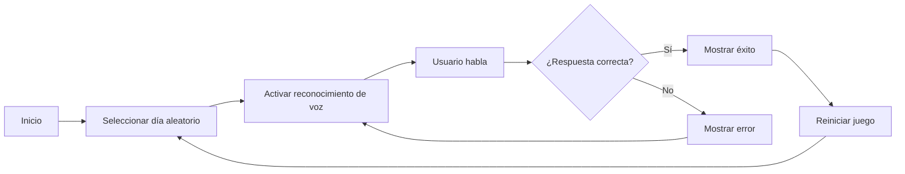

# 🎮 Adivina el Día de la Semana


## 📝 Descripción

**Adivina el Día de la Semana** es un juego interactivo web que utiliza reconocimiento de voz para crear una experiencia de juego única. El jugador debe adivinar qué día de la semana ha sido seleccionado aleatoriamente por el sistema usando únicamente su voz.

### ✨ Características

- 🎤 **Reconocimiento de voz en español** - Usa el micrófono para capturar las respuestas
- 🎲 **Selección aleatoria** - Cada partida es diferente
- 🔄 **Juego continuo** - Reinicio automático después de acertar
- 💫 **Interfaz intuitiva** - Mensajes claros con SweetAlert2
- 📱 **Responsive** - Funciona en dispositivos móviles y escritorio

## 🚀 Demo

[Ver Demo en Vivo](#) <!-- Agrega aquí el link a tu demo si tienes uno -->

## 🛠️ Tecnologías Utilizadas

- **JavaScript (ES6+)** - Lógica del juego
- **HTML5** - Estructura de la página
- **CSS3** - Estilos (asumido)
- **Web Speech API** - Reconocimiento de voz
- **SweetAlert2** - Notificaciones elegantes
- **DOM Manipulation** - Interacción con elementos HTML

## 📋 Requisitos Previos

- Navegador web moderno (Chrome, Edge, Safari)
- Micrófono habilitado
- Conexión a internet (para cargar SweetAlert2 si se usa CDN)

### Navegadores Compatibles

| Navegador | Versión Mínima | Soporte |
|-----------|---------------|---------|
| Chrome | 33+ | ✅ Completo |
| Edge | 79+ | ✅ Completo |
| Safari | 14.1+ | ✅ Completo |
| Firefox | 49+ | ⚠️ Parcial |
| Opera | 20+ | ✅ Completo |

## 💻 Instalación

### Opción 1: Clonar el repositorio

```bash
# Clonar el repositorio
git clone https://github.com/tu-usuario/adivina-dia-semana.git

# Navegar al directorio del proyecto
cd adivina-dia-semana

# Abrir index.html en tu navegador
# O usar un servidor local como Live Server en VS Code
```

### Opción 2: Descargar ZIP

1. Descarga el proyecto como ZIP
2. Extrae los archivos
3. Abre `index.html` en tu navegador

## 📁 Estructura del Proyecto

```
adivina-dia-semana/
│
├── index.html          # Página principal del juego
├── script.js           # Lógica del juego y reconocimiento de voz
├── styles.css          # Estilos (si aplica)
└── README.md          # Este archivo
```

## 🎮 Cómo Jugar

1. **Permitir acceso al micrófono** cuando el navegador lo solicite
2. **Esperar** a que el juego seleccione un día aleatorio
3. **Hablar claramente** diciendo un día de la semana en español
4. **Ver el resultado**:
   - ✅ Si aciertas: Mensaje de éxito y nuevo juego en 3 segundos
   - ❌ Si fallas: Mensaje de error e intenta de nuevo
5. **Continuar jugando** - El juego se reinicia automáticamente

### Días Válidos
- lunes
- martes
- miércoles
- jueves
- viernes
- sábado
- domingo

## 🔧 Configuración

### Dependencias Externas

Asegúrate de incluir SweetAlert2 en tu `index.html`:

```html
<!-- SweetAlert2 CDN -->
<script src="https://cdn.jsdelivr.net/npm/sweetalert2@11"></script>
```

### Estructura HTML Mínima

```html
<!DOCTYPE html>
<html lang="es">
<head>
    <meta charset="UTF-8">
    <title>Adivina el Día de la Semana</title>
</head>
<body>
    <div id="message"></div>
    
    <script src="https://cdn.jsdelivr.net/npm/sweetalert2@11"></script>
    <script src="script.js"></script>
</body>
</html>
```

## 🔍 Características Técnicas

### Reconocimiento de Voz

El juego utiliza la Web Speech API con las siguientes configuraciones:

- **Idioma**: Español (es-ES)
- **Modo**: No continuo (se reinicia después de cada intento)
- **Procesamiento**: Convierte a minúsculas y elimina puntuación

### Flujo del Juego



## 🐛 Solución de Problemas

### El micrófono no funciona
- Verifica que has dado permisos al navegador
- Asegúrate de usar HTTPS o localhost
- Comprueba que tu micrófono funciona en otras aplicaciones

### No reconoce mi voz
- Habla más claro y cerca del micrófono
- Verifica que el idioma de tu navegador sea español
- Intenta en un ambiente con menos ruido

### El juego no carga
- Verifica tu conexión a internet (para SweetAlert2)
- Asegúrate de que JavaScript esté habilitado
- Usa un navegador compatible

## 🤝 Contribuir

¡Las contribuciones son bienvenidas! Por favor, sigue estos pasos:

1. Fork el proyecto
2. Crea tu rama de características (`git checkout -b feature/NuevaCaracteristica`)
3. Commit tus cambios (`git commit -m 'Agregar nueva característica'`)
4. Push a la rama (`git push origin feature/NuevaCaracteristica`)
5. Abre un Pull Request

### Ideas para Contribuir

- [ ] Agregar más idiomas
- [ ] Implementar niveles de dificultad
- [ ] Agregar efectos de sonido
- [ ] Crear un sistema de puntuación
- [ ] Agregar modo multijugador
- [ ] Mejorar la interfaz visual
- [ ] Agregar estadísticas del jugador

## 📄 Licencia

Este proyecto está bajo la Licencia MIT - ver el archivo [LICENSE](LICENSE) para más detalles.

## 👨‍💻 Autor

**Tu Nombre**

- GitHub: [@tu-usuario](https://github.com/tu-usuario)
- LinkedIn: [Tu Nombre](https://linkedin.com/in/tu-perfil)

## 🙏 Agradecimientos

- [SweetAlert2](https://sweetalert2.github.io/) por las hermosas alertas
- [MDN Web Docs](https://developer.mozilla.org/) por la documentación de Web Speech API
- La comunidad de desarrolladores por el apoyo

## 📊 Estado del Proyecto

🟢 **Activo** - En desarrollo y mantenimiento activo

---

⭐ Si te gusta este proyecto, ¡dale una estrella en GitHub!